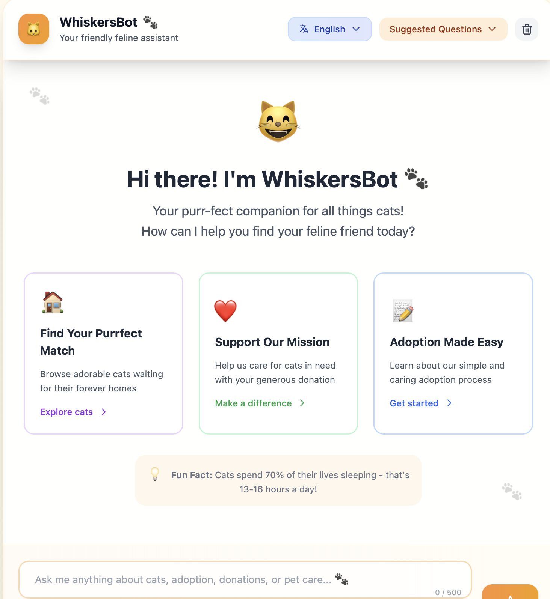
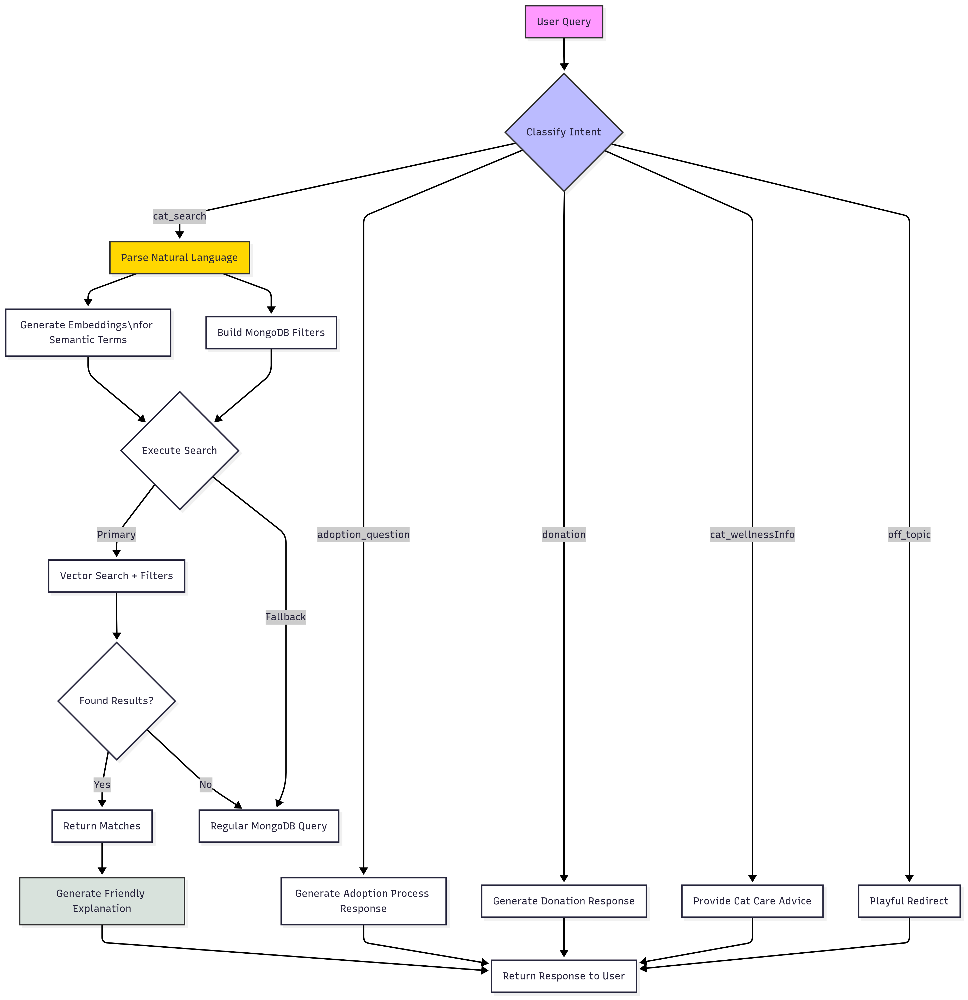
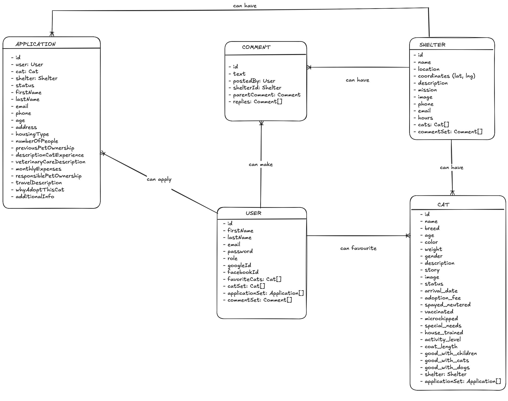
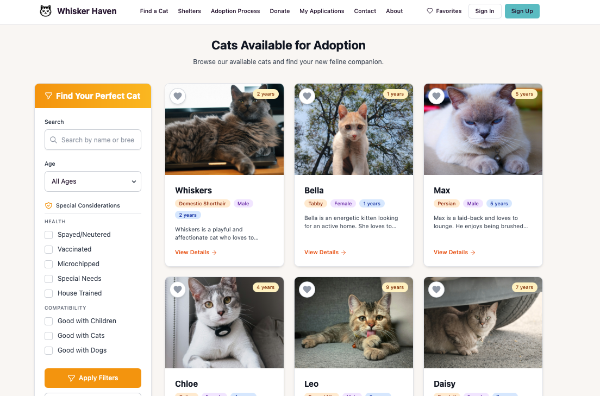
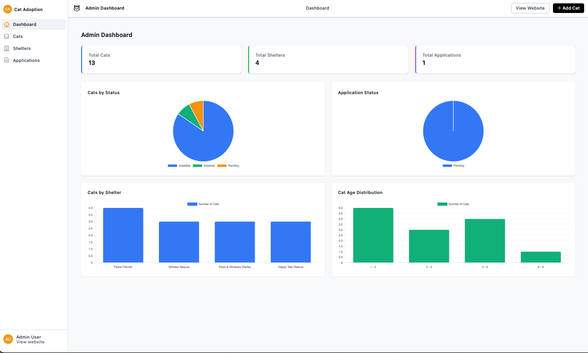
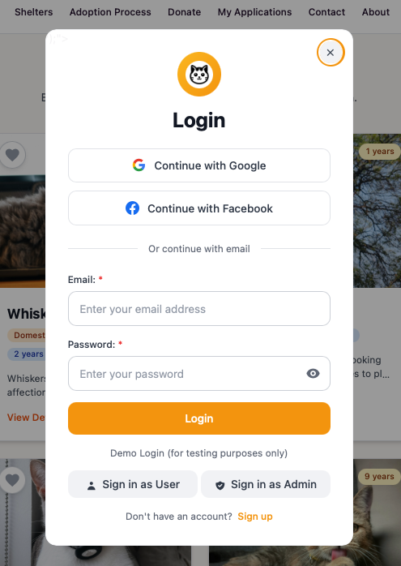
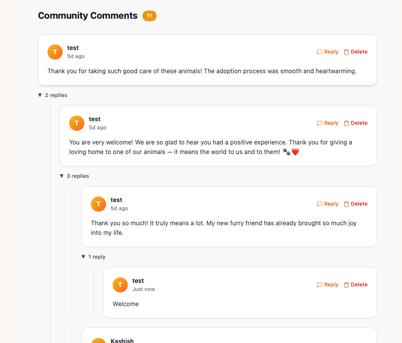
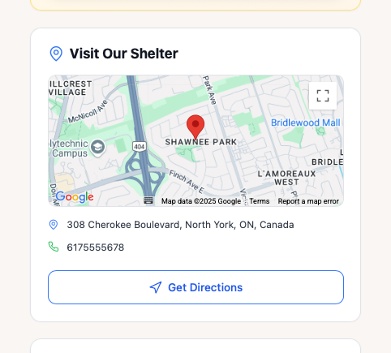
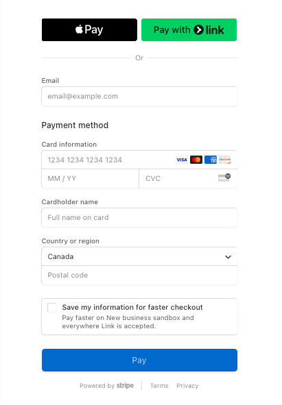

# WhiskersHaven - AI POWERED PET ADOPTION PLATFORM [](https://whisker-way.vercel.app/)

**Live Site:** [WhiskersHaven](https://whisker-way.vercel.app/)  
**AI-Powered Chatbot:** [WhiskerBot](https://whisker-way.vercel.app/chatbot)  
*An AI-powered platform revolutionizing cat adoption through intelligent matching*

**Experience WhiskerBot:**  
[](https://whisker-way.vercel.app/chatbot)

<div align="center">
  <a href="./assets/videos/whiskerBot.mp4" target="_blank">
    
    <br>
    <em>Click to watch WhiskerBot's AI matching system (30 sec)</em>
  </a>
</div>

## Table of Contents  
- [Description](#description)
- [Technology Stack](#technology-stack)  
- [Core Features](#core-features)
- [WhiskerBot AI System](#whiskerbot-ai-system)
- [Architecture Diagrams](#architecture)
- [Installation](#installation)  
- [Usage](#usage)  
- [Folder Structure](#folder-structure)
- [Feature Screenshot](#feature-screenshot)
- [Live Demo](#live-demo)
- [Read Blog](#the-story-behind-whiskerBot)
##  🐾 Description  

**WhiskersHaven** combines full-stack development with cutting-edge AI to create a next-generation pet adoption platform. The star of the system is WhiskerBot - an intelligent chatbot that uses natural language processing and vector search to match adopters with their perfect feline companions.

 ## Technology Stack  
 
- **AI Core**:  
    - OpenAI GPT-3.5-turbo & vector text-embedding-3-small   
    - MongoDB Atlas Vector Search  
    - Natural Language Processing pipeline

- **Backend**: Node.js, Express.js, Passport.js (local & OAuth), JWT, Bcrypt.js, Joi, Multer, Mongoose
- **Frontend**: EJS, Tailwind CSS
- **Database**: MongoDB Atlas (with vector embeddings)
- **APIs & Integration**:
    - Stripe (payments)
    - Nodemailer (email sending),
    - Chart.js (data visualization)
    - Google Maps JavaScript API (location services)
    - Cloudinary (image hosting)
- **Deployment**: Vercel

## Core Features

#### WhiskerBot AI System
  - Natural language understanding for smart serach and related queries
  - Semantic vector search for "vibe-based" matching
  - Multi-lingual response generation
  - Intent classification to handle diverse questions
  - Context-aware response generation

  #### User Authentication and Security  
  - User authentication with **Passport.js** and **JWT**
  - Social Login via **Google OAuth** and **Facebook**.
  - **Role-Based Access Control (RBAC)** for Admin and User roles with separate UIs
  - Security: Bcrypt hashing, form validation(client-side), Joi(server-side)
    
  #### Core Functionalities
  - Search, Filter, paginate to navigate
  - **Reddit-style nested comments** with recursive MongoDB schema for threaded discussions
  - View detailed cat profiles and shelter information with **Google Maps** location integration
  - User-centric features: Mark favorites and manage adoption applications
  - Full Adoption Workflow
    
  #### Admin Dashboard
  - RBAC-secured dashboard for admins only
  - Admin controls for managing users, shelters, and applications
  - **Chart.js** for dynamic adoption analytics

  #### Integrations
  - **Stripe Checkout** for seamless donation processing
  - **Nodemailer** integration to send contact form messages directly to the organization
  - **Google Maps** API to visually pinpoint shelter locations
  - **Chart.js** for clear, real-time data visualization on the admin dashboard
  - **Cloudinary + Multer** for optimized image uploading and cloud hosting

## Architecture

### WhiskerBot AI System

A complete workflow diagram illustrating how WhiskerBot classifies intent, parses queries, performs vector search, and generates personalized cat recommendations.
<div align="center">
  
</div>


 ### DATA MODEL - The ER diagram below outlines the core data model of WhiskersHaven
<div align="center">
  
</div>

## Installation

### Clone the Repository
```bash
git clone git@github.com:KashishV999/WhiskerWay.git
cd WhiskerWay
```

### Install the dependencies
```bash
npm install
```
### Setup the environment Variables
```bash
# MongoDB Atlas
MONGODB_CONN_STRING=mongodb+srv://<username>:<password>@cluster0.mongodb.net/Whisker-Way?retryWrites=true&w=majority
SECRET_KEY=your_mongo_secret_here

# Cloudinary
CLOUDINARY_CLOUD_NAME=your_cloud_name
CLOUDINARY_API_KEY=your_api_key
CLOUDINARY_API_SECRET=your_api_secret

# Google OAuth
CLIENT_ID=your_google_client_id
CLIENT_SECRET=your_google_client_secret
CALLBACK_URL=http://localhost:3000/api/auth/google/callback  # For local dev

# Facebook OAuth
FACEBOOK_APP_ID=your_facebook_app_id
FACEBOOK_APP_SECRET=your_facebook_app_secret
FACEBOOK_CALLBACK_URL=http://localhost:3000/api/auth/facebook/callback  # For local dev

# Google Maps API
GOOGLE_MAPS_API=your_google_maps_api_key

# Stripe
STRIPE_PUBLISHABLE_KEY=your_stripe_publishable_key
STRIPE_PRIVATE_KEY=your_stripe_private_key

# Email
EMAIL_USER=your_email@example.com
EMAIL_PASS=your_email_password

#OPENAI
OPENAI_API_KEY=your_open_ai_key
```
### Start the Application
```
npm start
```
or

```
nodemon app.js
```
### Open your browser and visit
```
http://localhost:3000
```


## Usage
### 🔐 Explore the App

- Click **“Sign In”** on the top right to open the login modal.
- Use **Google/Facebook login**, or try the demo buttons (Quick Access Demo):
  - **Sign in as User** 
  - **Sign in as Admin**

> ✨ Demo buttons auto-fill credentials and take you directly to the respective dashboards.


## Folder Structure  

```
WhiskerWay/

├── app.js                         # Entry point of the application
├── config/                        # Configuration files
│   ├── Auth.js                    # JWT authentication configuration
│   ├── database.js                # MongoDB connection setup
│   ├── cloudinary.js              # Cloudinary configuration
│   ├── passportGoogle.js          # Google OAuth configuration
│   ├── passportJwt.js             # JWT authentication configuration
│   ├── passportFacebook.js        # Facebook OAuth configuration
│   └── emailService.js            # Email service configuration
├── data/                          # Seed data
│   ├── catData.js                
│   └── shelterData.js            
├── models/                        # Mongoose models
│   ├── cat.js                   
│   ├── shelter.js                
│   ├── application.js             
│   ├── user.js                   
│   └── comments.js
├── services/                      # Services layer for external integrations
│   ├── openaiService.js           # Handles communication with OpenAI APIs (chat & embeddings)
├── public/                        # Static assets
│   ├── css/                      
│   ├── js/                       
│   └── images/                   
├── routes/                        # Application routes
│   ├── catsRoute.js               # Routes for cats
│   ├── shelterRoute.js            # Routes for shelters
│   ├── nestedRoutes.js            # Routes for nested 
│   ├── adminRoutes.js             # Admin dashboard routes
│   ├── authRoutes.js              # Authentication routes
│   ├── userRoutes.js              # User profile routes
│   ├── contactRoutes.js           # Contact form routes
│   ├── commentRoutes.js           # Comment system routes
│   └── paymentRoutes.js           # Payment processing routes 
├── seeds/                         # Database seeding scripts
│   ├── seedCats.js               
│   └── seedShelters.js          
├── views/                         # EJS templates
│   ├── layouts/                   # Layout templates
│   ├── partials/                  # Reusable partials
│   ├── cats/                      # Cat views
│   ├── shelters/                  # Shelter views
│   ├── adoption/                  # Adoption process views
│   ├── adminDashboard/            # Admin dashboard views
|   ├── chatBot.ejs                # EJS template for the chatbot interface
│   └── error.ejs                  # Error page template
├── schemaSecurity.js              # Joi validation schemas
```
## Feature Screenshot

### Role-Based Access Control (RBAC)
|  |  |
|:--:|:--:|
| *User View* | *Admin Dashboard with Real-Time Analytics* |

### Social Login and Reddit-Style Nested Comments
|  | <br>[Try It Out](https://whisker-way.vercel.app/shelters/682bb915e21083b8b4b4a872#comments-section) |
|:--:|:--:|
| *User Social Login (Google & Facebook OAuth)* | *Recursive Reddit-Style Nested Comments* |

### Google Maps Integration and Stripe Donation Checkout
|  |  |
|:--:|:--:|
| *Google Maps - Shelter Location* | *Stripe - Donation Checkout* |


## **Live Demo**  
> 💡 Explore more features like detailed cat/shelter pages, search filters, application management, and contact email integrations live on the site, admin functionalities.

[](https://whisker-way.vercel.app)

---

## **The Story Behind WhiskerBot**  
**Featured in my technical blog post:**  
[Inside Whiskers Haven: How I Built an AI Chatbot for Pet Adoption](https://www.kashishverma.com/blog/whiskerBot/firstBlog)

In this deep dive, I cover:
- 🧠 Intent classification architecture
- 🔍 Vector search implementation
- 😸 Handling quirky user queries (like 3AM pizza cravings)
- ❤️ Heartwarming adoption success stories

*"The moment a user typed 'I found my soulmate cat!' after months of searching, I knew this was more than code."*

[Read the full article →](https://www.kashishverma.com/blog/whiskerBot/firstBlog)


